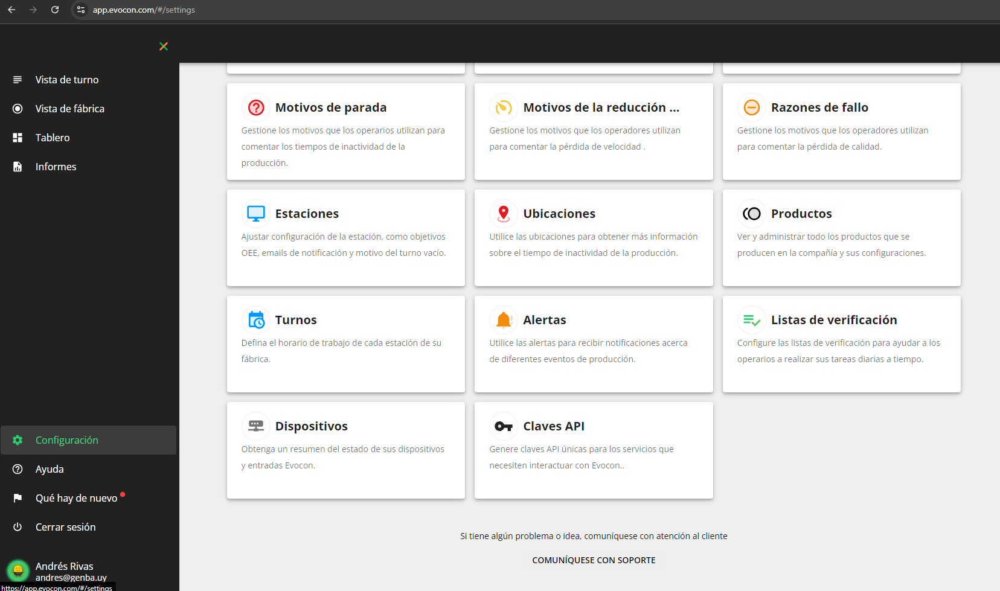
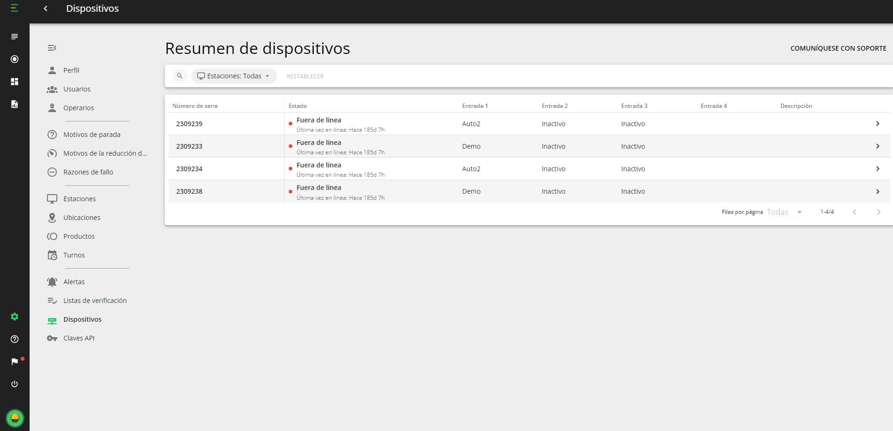

## Data visualization

    https://app.evocon.com/#/shiftview

    Usuario andres@genba
    Password E87hOFxe

## Adding new portenta device to Evocon

1. Ask Evocon to create dashboard for a new client and receive de device id APINAME
2. Send device MAC address to Evocon

## Getting internet time

Here's our EPOCH time server address:
https://devices.evocon.com/EvoconReportingServer/rest/v1/time/APIGENBA

## Data reporting

### Single line register

https://api.evocon.com/shards?deviceId=APIGENBA&inputNumber=5&eventTime=1649078157&signal=1

### JSON message for multiple inputs

We made a new endpoint for multiple shard events via a single POST query.
The endpoint name is still shards, but you must add a query parameter multiple=true; thus, the POST link will look like this: https://api.evocon.com/shards?multiple=true

Also, you will need to send a JSON list.

    [
        {
            "deviceId": "APINAME",
            "inputNumber": 1,
            "eventTime": 1673001900,
            "signal": 10
        },
        {
            "deviceId": "APINAME",
            "inputNumber": 2,
            "eventTime": 1673001900,
            "signal": 3
        },
        {
            "deviceId": "APINAME",
            "inputNumber": 3,
            "eventTime": 1673001900,
            "signal": 1
        }
    ]

If you want to send a single event, it must also be in a list like so

    [
        {
            "deviceId": "APINAME",
            "inputNumber": 1,
            "eventTime": 1673001900,
            "signal": 10
        }
    ]

## How to see if the device is online

The way to make a device be online is to make a get request to 
https://devices.evocon.com/EvoconReportingServer/rest/v1/time/fcc23d18d7c2
every 5 minutes. 

Now actually testing it with some API endpoints, it turns out that you can use this request to update the device status. 
https://devices.evocon.com/EvoconReportingServer/rest/v1/time/APISAMAN
Please send a GET request to this URL and the device will show as Online in the settings. 

## Evocon support

https://evocon.notion.site/Help-Support-1fce89bd3f624aba977dbbda5ef0224a

    Commercial contact karel@evocon.com
    Technical contact erki@evocon.com
    Support contact support@evocon.com

## About this code

This code is based on the Arduino Core for Mbed devices
https://registry.platformio.org/tools/platformio/framework-arduino-mbed

## Line inputs numbers for Adium

https://docs.google.com/spreadsheets/d/19DP-8F4ckhvYHnfBg3IiPtPMMPCcYtkH4N1F6mz8iFY/edit?gid=0#gid=0

## Get active product from Evocon

https://api.evocon.com/api/reports/activeproduct?stationId=9

## Multipliers

Signal multiplier -   This decimal value is multiplied by the Signal value
       of the data event and added as the total and good
       quantity of a circle in the Shift view.
0 means that the result of the multiplication is 0
and a circle is not added to the Shift view.
<0 means that the result is negative and total
quantity is removed from the previous circle
>0 means that 1 signal does not mean 1 
unit of production.
For example, if 1 signal always means 6 bottles of water,
we can use 6 as Signal multiplier to get 6 bottles per 1 signal.
Or if 1 signal of an encoder output means 0.01 meters of produced
material, we can specify Signal multiplier as 0.01 and need
not set this value for each product in the Settings.
Scrap multiplier  -   Similar to signal multiplier.
0 means that scrap is not added or removed as a result of processing
this event
<0 means that the result of multiplication worth of scrap will be
removed from the previous circle(s). If the previous circle does not
have enough scrap, the system will search previous circles until
a changeover or shift change is reached.
>0 means that the result of multiplication worth of scrap will be
added to the previous circle(s). If the good quantity of the previous
circle is less than scrap to be added, the system will look for a
previous circle to change good quantity to scrap quantity.

Scrap reason id - If Scrap multiplier is used, specifying scrap reason id will make the system automatically assign this scrap reason Id. Useful if an input is connected to one specific scrap signal (weight or fill level check)

## MAC

    MAC ADDRESS 00:80:e1:3a:00:3a